[](https://classroom.github.com/a/34i4sppu)

# Lab 05 — Orchid Management (Single Page Application)

Ứng dụng quản lý hoa lan gồm **REST API** (Spring Boot 3 + JPA + MS SQL Server) và **giao diện SPA** (React 18 + Vite + react-bootstrap).

| Mã sinh viên | Họ tên | Email |
| ------------ | ------ | ----- |
| DE190530 | Phạm Đăng Khoa | pdangkhoa76@gmail.com |

## Cấu trúc dự án

```
├── orchid-management/   ← Spring Boot back-end (pojos, repositories, services, controllers)
└── orchid-fe/           ← React front-end (components, pages, context, reducers, utils)
```

## Cách chạy

**Back-end** (`http://localhost:8080`)
```bash
cd orchid-management
# Tạo src/main/resources/application.properties từ application.properties.example
mvn spring-boot:run
```

**Front-end** (`http://localhost:5173`)
```bash
cd orchid-fe
# Tạo .env từ .env.example
npm install
npm run dev
```

## REST API

| Method | URL | Mô tả | Status |
|---|---|---|---|
| GET | `/orchids/` | Lấy tất cả orchid | 200 |
| GET | `/orchids/{id}` | Lấy orchid theo id | 200 / 404 |
| POST | `/orchids/` | Tạo orchid mới | 201 |
| PUT | `/orchids/{id}` | Cập nhật orchid | 200 / 404 |
| DELETE | `/orchids/{id}` | Xóa orchid | 204 / 404 |

## Demo — Test API bằng Postman

### 1. POST `/orchids/` — Tạo mới → `201 Created`


### 2. GET `/orchids/` — Lấy tất cả → `200 OK`
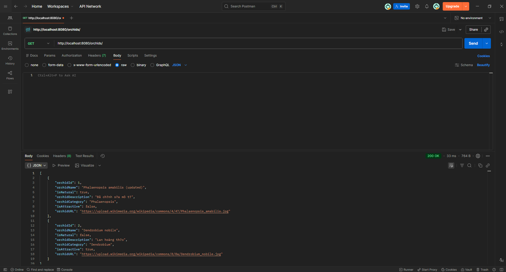

### 3. GET `/orchids/{id}` — Lấy theo id
**id hợp lệ → `200 OK`**
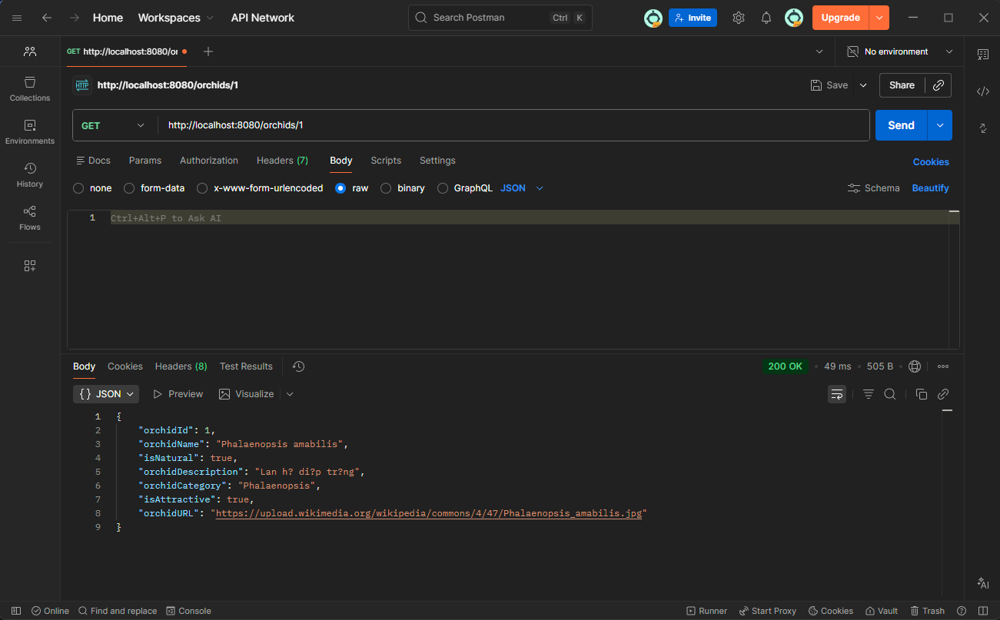

**id không tồn tại → `404 Not Found`**
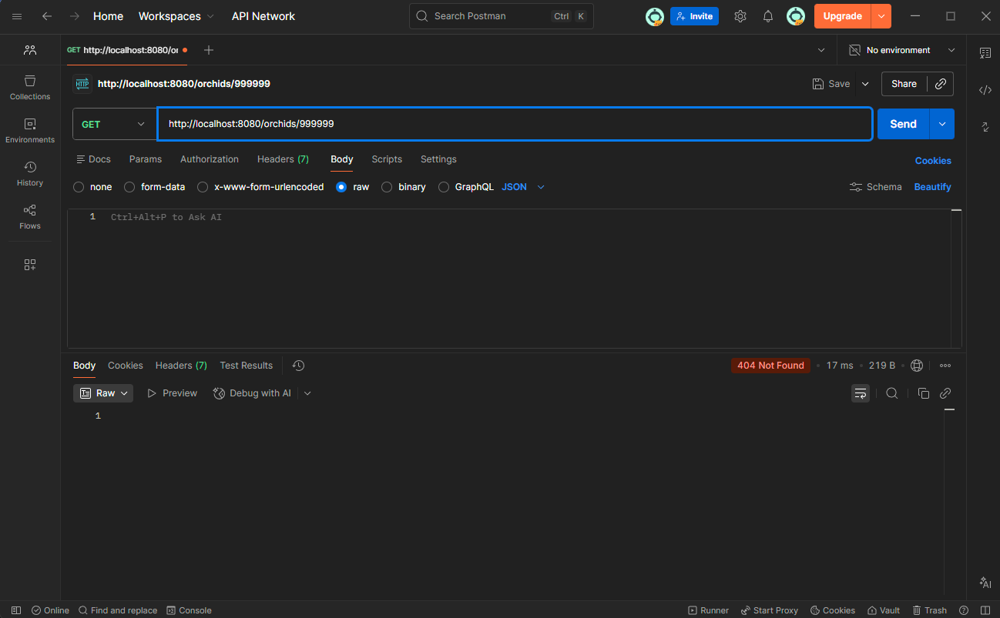

### 4. PUT `/orchids/{id}` — Cập nhật
**id hợp lệ → `200 OK`**
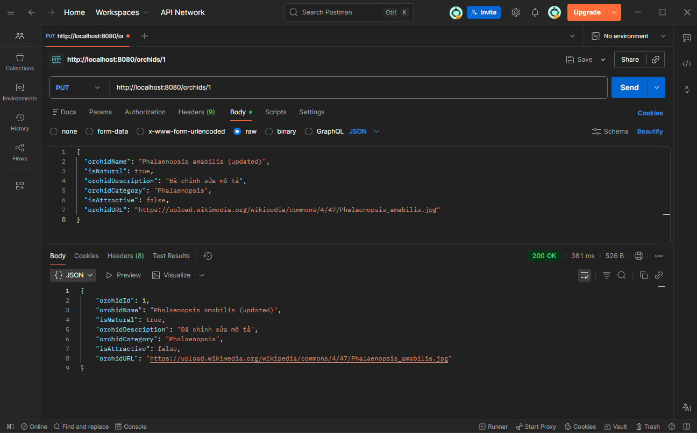

**id không tồn tại → `404 Not Found`**
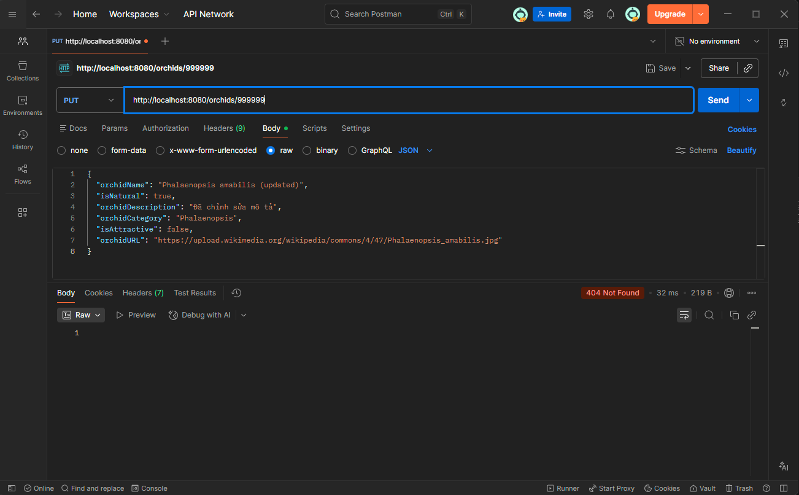

### 5. DELETE `/orchids/{id}` — Xóa
**id hợp lệ → `204 No Content`**
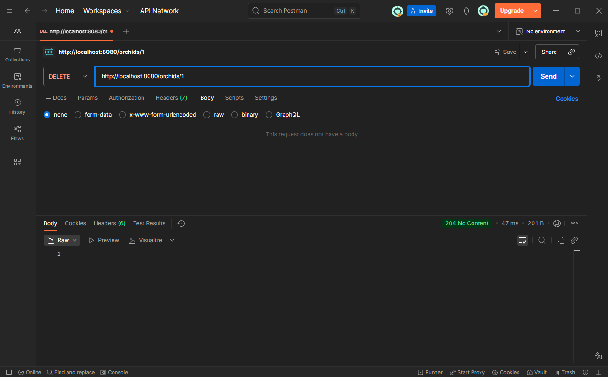

**id không tồn tại → `404 Not Found`**
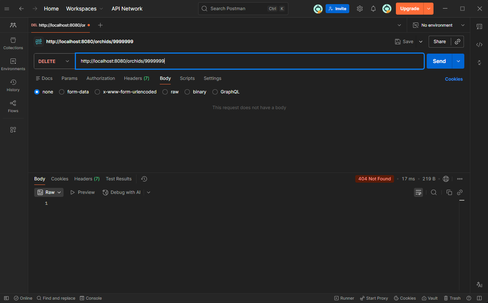

## Demo — Giao diện React

### 1. Trang chủ — Danh sách (Table view)
NavBar dark, bảng striped, Badge màu (Natural/Hybrid, Attractive/Normal), nút Edit/Delete.
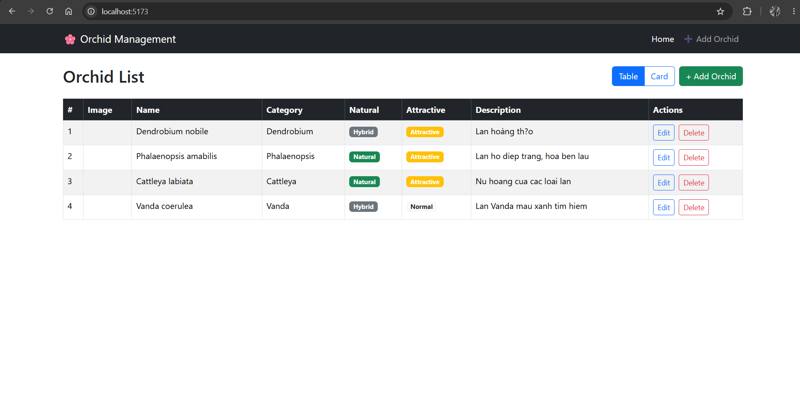

### 2. Trang thêm mới — Add Orchid
Form react-bootstrap, switch Natural/Attractive, nhập URL ảnh.
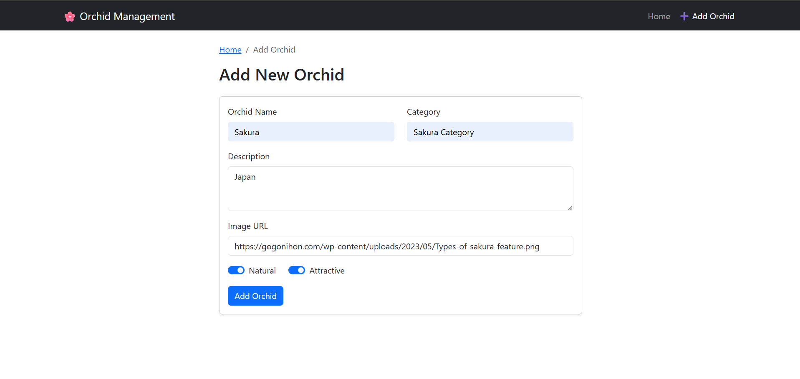

### 3. Trang chỉnh sửa — Edit Orchid
Form load sẵn dữ liệu cũ theo id, có preview ảnh.
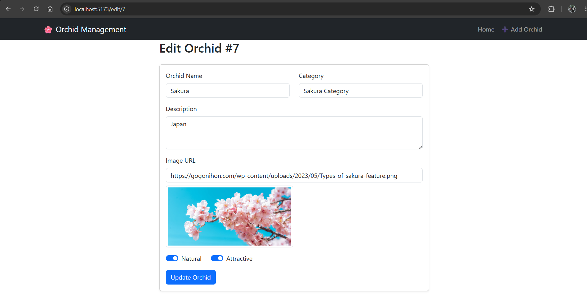

### 4. Modal xác nhận xóa
Hiển thị tên orchid in đỏ, nút Hủy / Xóa.
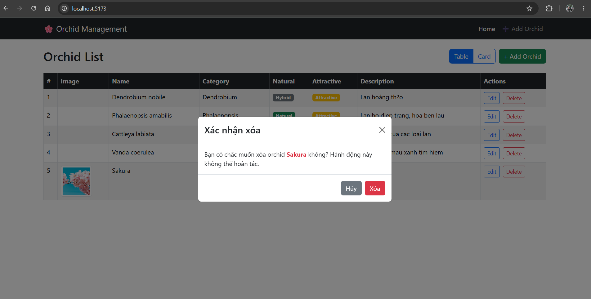
